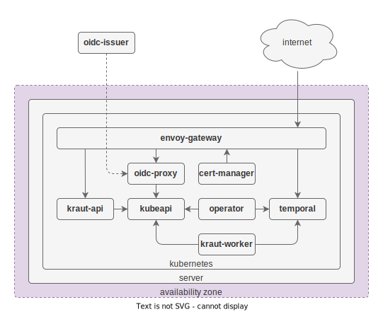

# Architecture

This document provides insight into the architecture and the subcomponents of `kraut`.

## Overview

- **Envoy Gateway**  
  A reverse proxy using the [Envoy Gateway][envoy-gateway] to expose the `kraut-api`, the `temporal-ui`, the `oidc-proxy` and other services to the outside world.

- **OIDC proxy**  
  A simple HTTP server that serves the OIDC discovery document and the JWKs of the Kubernetes API server with a trusted certificate. This allows the service acconts of the Kubernetes cluster to perform an [OAuth 2.0 Token Exchange (RFC8693)][rfc-8693] with external OIDC provider. This is a requirement for cross-cluster authentication.

- **[Temporal][temporal]**  
  A workflow engine that is used to orchestrate and execute infrastructure automation processes.

- **Kraut API**  
  A REST API that provides the functionality to manage the `kraut` resources with a cluster and across clusters.

- **Kraut Operator**  
  A tiny adapter that dispatches reconciliations to the `kraut-worker` via `temporal`.

- **Kraut Worker**  
  A worker process that runs workflows, such as infrastructure automation processes.

## FAQ

### Why not use the Kubernetes API server directly instead of the Kraut API?

The Kubernetes API server has its own certificates, which make it difficult to expose it to the outside world. The `kraut-api` instead uses trusted certificates which provides a simplified API surface. The goal is however to only provide a shim. All business logic is implemented in the `kraut-worker`. Hence, you are still able to use `kubectl`, `helm` and GitOps to interact with `kraut`.

### Why use Temporal?

Temporal is a powerful workflow engine that ensures that complex renconciliations are executed in a reliable and scalable manner. More specifically, it allows to schedule reconciliations across clusters, which is necessary if the underlying Kubernetes version or server OS needs to be upgraded.

[rfc-8693]: https://www.rfc-editor.org/rfc/rfc8693.html
[envoy-gateway]: https://gateway.envoyproxy.io/
[temporal]: https://temporal.io/
